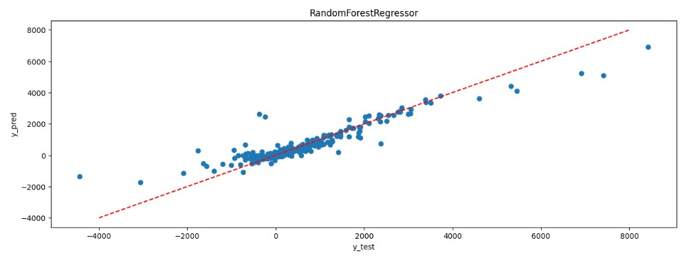
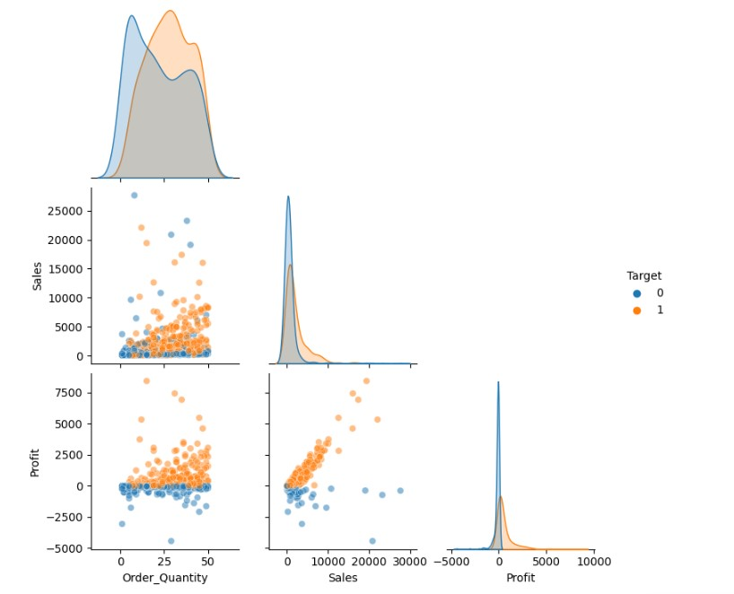
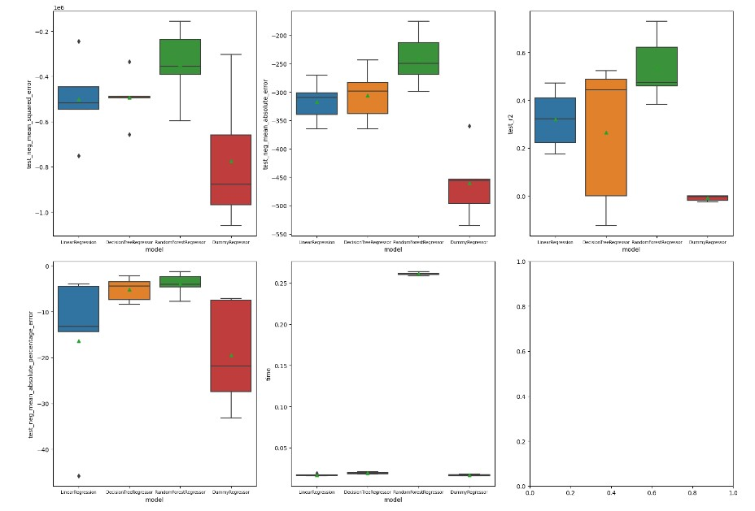
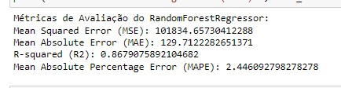

# Desafio Cientista de dados I

## Objetivos:

- Imagine que você é Cientista de Dados e está responsável por um projeto no qual a
Federação das Indústrias está prestando consultoria para um e-commerce. O Cliente está
querendo aumentar o seu faturamento e devido a questões de negócios como problemas
com fornecedores, promoções mal planejadas, incidência de impostos e afins, algumas
vendas podem resultar em prejuízo Atualmente, essas informações não estão disponíveis
previamente. Dessa forma, faça um modelo que preveja o Lucro (Profit) ou prejuízo de
vendas feitos no e-commerce. Caso o algoritmo identifique que haverá prejuízo, o site irá
indeferir a compra, enviando-a para que um analista possa verificar o que está ocorrendo.

## Main libraries used:
- Pandas, Numpy, Matplotlib, Sklearn, Seaborn, Imblearn.

## Etapa 1: EDA
- Nessa primeira etapa tive o entendimento da base de dados, com os comando base.head(),base.info() e base.describe(), já com esses três comandos verifique que existiam muitas colunas textuais e apenas 4 colunas numericas, sendo uma delas o Order_ID.
- Para me auxiliar no entendimento da base, importei a biblioteca ydata_profiling que me fornece alguns dados já detalhados me poupando um pouco de tempo.
- Percebi que as colunas Customer_name e Order_ID não me ajudariam com a análise, visto que possuiam muitos valores diferentes, apesar de alguns se repetirem.
- Entre as 3 colunas númericas restantes na base fiz um gráfico de dispersão para ter um melhor entendimento.
- Criei uma coluna chamada 'Target' para verificar se me ajudava na visualização de algum padrão.
- Com o Pairplot, consegui entender que, normalmente, quanto menor 'Order_Quantity' maior a chance de ter prejuizo e quanto maior o valor da compra, menor, menor a chance de ter prejuizo.

- Avaliando as colunas de texto, percebemos que 'Product_Name' e 'Product_Sub-Category' possuem mais valores únicos que os demais.
- 'Ship_Mode', 'Customer_Segment' e 'Product_Container' possuem mais de 70% do seu resultado vindo de uma única variável.
- Como última etapa da etapa 1, Irei aplicar o pré-processamento, logo preciso excluir a variável 'Target' para evitar ter problemas com o modelo.

## Etapa 2: Pré-processamento e Pipeline
#### Separando para o pré-processamento, escolhi os seguintes modelos de preprocessing.
##### [OrdinalEncoder](https://scikit-learn.org/stable/modules/generated/sklearn.preprocessing.OrdinalEncoder.html): Order_Priority, Product_Container 
- Colunas são valores categoricos, uma variável possui ordem grandeza definida.
##### [OneHotEncoder](https://scikit-learn.org/stable/modules/generated/sklearn.preprocessing.OneHotEncoder.html): "Ship_Mode", "Region", "Customer_Segment" e "Product_Category"
- Colunas possuem poucos valores distintos e sem ordem de grandeza definida.
##### [LabelEncoder](https://scikit-learn.org/stable/modules/generated/sklearn.preprocessing.LabelEncoder.html): 'Product_Sub-Category', 'Product_Name'.
- Colunas que possuem vários valores únicos, mas acredito serem importantes para o modelo.
##### [MinMaxScaler](https://scikit-learn.org/stable/modules/generated/sklearn.preprocessing.MinMaxScaler.html) : 'Order_Quantity', 'Sales'
- Colunas numéricas que estão com diferença de intervalos muito grande, então irei deixar em escalas similares
------
- Para um modelo que necessita prever, optei por escolher 4 modelos que já possuo familiaridade, Regressão Linear, Arvore de Regressão, Random Forest, Um DummyClassifier foi utilizado como baseline.
-Após gerar um dicionario com as respostas obtidas pelo pipeline, criei uma "base_results_explode" para conseguir plotar em boxplots para definir qual o melhor modelo.
- O Modelo escolhido foi o **RandomForestRegressor**
  

## Etapa 3: Ajuste de hiperparâmetro
- Como já defini qual será meu modelo, refaço a etapa de preprocessamento e pipeline, realizo o fit e verifico as 5 colunas que tiveram o melhor aproveitamento no modelo.
- Utilizo o GridSearchCV para adaptar os hiperparâmetro.
- Após o fit, verifico quais são os hiper parametros que melhor se adaptam e verifico as métricas de avaliação.

